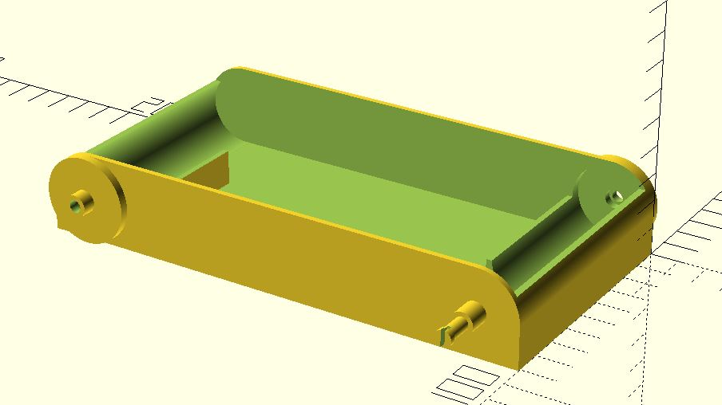
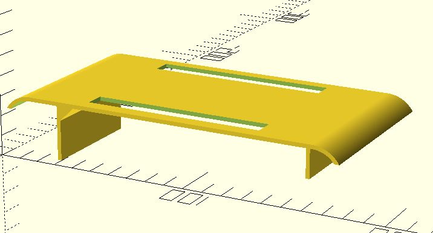
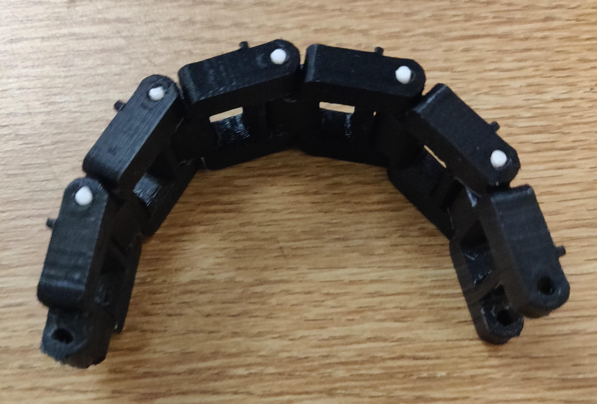

##### Components Used:
* [2 12V DC Motors](https://www.amazon.com/gp/product/B00B1KZ8UU/)
* [Motor Controller](https://www.amazon.com/gp/product/B014KMHSW6/)
* [Arduino Mega](https://www.amazon.com/Elegoo-EL-CB-003-ATmega2560-ATMEGA16U2-Arduino/dp/B01H4ZLZLQ/)
* [Jumper Wires](https://www.amazon.com/gp/product/B01MU0IMFF)
* Ultrasonic Sensor
* 3D printed Body & Treads

## The Problem

My primary goal for this project was to create a small vehicle using electrical components and 3D printed parts. I wanted to avoid buying wheels or using prebuilt kits for the project which led me to the tank-style design as I could easily 3D print the necessary components for the treads.

An additional goal for the project was to give the vehicle basic autonomy through obstacle avoidance. Rather than creating a complex system for mapping the environment and keeping track of the vehicles location I opted for a simpler object avoidance approach. The vehicle will drive forward until it encounters and object in its path, and then it will turn until the path is clear and continue forward. This is comparable to the style of autonomy that modern vacuums like the Roomba use.

## Inspirations

Before beginning this project, I decided to take a look at the work other people have done on similar problems. I was mainly focused on finding the best way to design the wheels for the vehicle in order to maximize traction and speed.

During my search I discovered a design on [Thingiverse](https://www.thingiverse.com/thing:467807) that was using tank treads rather than wheels. I decided that the increased surface area of the tank treads would help maximize traction and chose to use a similar design for this project. I made some slight modifications to the original design in order to fit the gears onto the body that I designed for the vehicle.

I also found a simple RC car project on [Howtomechatronics](https://howtomechatronics.com/tutorials/arduino/arduino-dc-motor-control-tutorial-l298n-pwm-h-bridge/) which I occasionally used as a reference for circuitry and electric parts throughout this project.

## The Project

I began this project by designing the body of the vehicle on OpenSCAD. Contrary to many of the other designs that I looked at, I chose to place the motors in separate corners of the vehicle to keep it from being unnecessarily wide and to disperse the weight of the motors more evenly across the vehicle.



The OpenSCAD code for the vehicle body can be [viewed on github](https://github.com/jjacobson/Robotank/blob/master/body/tank_body.scad). I tried to keep as much the OpenSCAD design as parametric as possible so it should be relatively easy to replace components with ones of different dimensions or change the overall vehicle dimensions.

The top of the vehicle is printed separately from the body and can be snapped into place after all the internal wiring has been completed. The motor controller is then mounted to the top.



The OpenSCAD code for the vehicle top can also be [viewed on github](https://github.com/jjacobson/Robotank/blob/master/body/tank_body_top.scad).

The treads and are a slightly modified version of the ones given in the [Thingiverse](https://www.thingiverse.com/thing:467807) project mentioned above. I decided that I did not like how the front gears were smaller than the back ones so I modified them to be the same height. The modified FreeCAD files are available in the project's [github repository](https://github.com/jjacobson/Robotank/tree/master/tracks). The full-circle gear snaps on to the axle attached to the vehicle body, and the half-circle gear is attached to each motor's shaft. 



The individual treads are held together with small pieces of 1.75mm filament which are placed in the holes at either end of each piece of tread. The pieces of tread had to be individually filed down to make them fit together and rotate smoothly.

The next step in the project was writing the control code for the Arduino. 

```C++
#define power 23

#define enA 9
#define in1 22
#define in2 7

#define enB 8
#define in3 6
#define in4 24

#define trig 13
#define echo 12
long duration;
int distance;

void setup() {
  pinMode(power, INPUT);
  
  pinMode(enA, OUTPUT);
  pinMode(in1, OUTPUT);
  pinMode(in2, OUTPUT);
  
  pinMode(enB, OUTPUT);
  pinMode(in3, OUTPUT);
  pinMode(in4, OUTPUT);

  pinMode(trig, OUTPUT);
  pinMode(echo, INPUT);

}

void loop() {

  // disable if jumper switch is disconnected
  digitalWrite(power, HIGH);
  if (digitalRead(power) == 1) {
    analogWrite(enA, 0);
    analogWrite(enB, 0);
    return;
  }

  // measure distance to objects in path
  digitalWrite(trig, LOW);
  delayMicroseconds(2);
  digitalWrite(trig, HIGH);
  delayMicroseconds(10);
  digitalWrite(trig, LOW);
  duration = pulseIn(echo, HIGH);
  distance = duration * 0.034 / 2;

  // reverse left motor if path not clear
  if (distance <= 20) {
    digitalWrite(in1, LOW);
    digitalWrite(in2, HIGH);
  } else {
    digitalWrite(in1, HIGH);
    digitalWrite(in2, LOW);
  }
  
  digitalWrite(in3, HIGH);
  digitalWrite(in4, LOW);
  
  analogWrite(enA, 255);
  analogWrite(enB, 255);
}
```

The Arduino control code begins by setting up the pinMode for the power, motor, and ultrasonic sensor pins. In the loop function it checks if the jumper wires which I use for turning it on and off are connected. If the power jumpers are disconnected it disables the motors and returns from the function. If they are connected it uses the ultrasonic sensor to measure the distance to the nearest object in the vehicle's path. If something is within 20cm it reverses the direction of one of the motors. It then writes the speeds to the motors which causes it to turn if something is in the path or continue straight if it's clear. 

There is currently no speed control for the motors, they are either fully on or off. If I expand this project to allow manual control in the future that will be something that I will change to allow for better control of the vehicle speed.

## The Result

<iframe width="750" height="422" src="https://www.youtube.com/embed/EfkwKTTyvyM" frameborder="0" allow="accelerometer; autoplay; encrypted-media; gyroscope; picture-in-picture" allowfullscreen></iframe>

As can be seen above, the finished vehicle was able to successfully navigate around objects placed in its path. And despite my concerns the 9V battery that I used was able to power both motors and the ultrasonic sensor without fail. 

The treads provided adequate traction for the vehicle to move any surface that I tested it on, although the battery was not strong enough to power the motors up inclines or on some thicker carpets.

## Next Time

Although the project was an overall success, there are a few small changes that I would make if I was to do it again. The first change I would make would be planning out the battery system more thoroughly from the beginning. I ended up only using a single 9V battery to power the entire vehicle, which was a little underpowered. In the future I would use a battery holder with an on/off switch mounted to the top of the vehicle so that I could increase the power of the vehicle and have easy access to controlling whether it was turned on. 

Additionally, I would try to find a way to improve obstacle detection for objects off the edge of the vehicle's path. Currently the ultrasonic sensor can miss obstacles that are off to the edge of its small field of view causing the vehicle to try to drive past things that will hit the tracks. I considered using a stepper motor connected to the sensor so that it could view a larger angle in front of the vehicle, but it was outside the scope of this project.