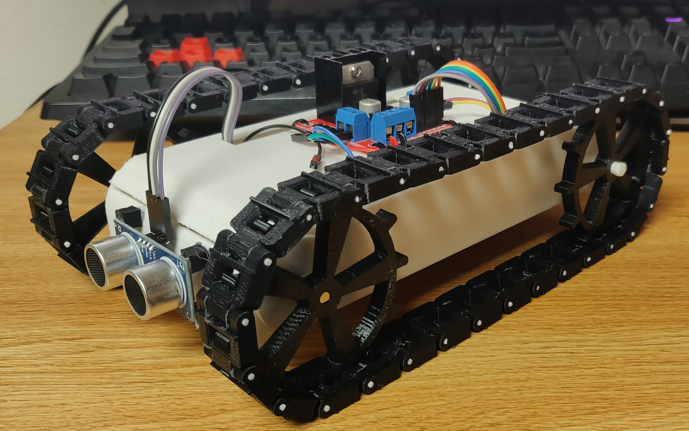

<div style="text-align:center"></div>

### The Problem

Placeholder

### Inspirations

Before beginning this project I decided to take a look at the work other people have done on similar problems. I was mainly focused on the best way to design the wheels for the vehicle in order to maximize traction and speed.

Druing my search I discovered a design on [Thingiverse](https://www.thingiverse.com/thing:467807) that was using tank treads rather than wheels. I decided that the increased surface area of the tank treads would help maximize traction, so I decided to use a similar design for my project.

### The Project

Placeholder

### The Result

Placeholder

### Next Time

Markdown is a lightweight and easy-to-use syntax for styling your writing. It includes conventions for

```markdown
Syntax highlighted code block

# Header 1
## Header 2
### Header 3

- Bulleted
- List

1. Numbered
2. List

**Bold** and _Italic_ and `Code` text

[Link](url) and 
```